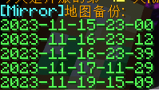

# <div align="center">Mirror</div>

<div align="center">


</div>

---

## Mod简介

Mirror是一款用于fabric服务端管理存档备份的mod

## 主要功能：
#### 存档备份
#### 一键回档

## 使用说明

使用存档备份指令需要获取op权限，并且权限等级为4

Mod在初始化时会检查备份文件夹--服务端根目录下的```MirrorBackup```文件夹以及其中的回档脚本是否存在，
若不存在则会自动创建


```
/mirror backup [tag]
```
会在5s的延迟后执行备份操作，未输入tag时默认为当前日期时间为备份文件名

备份文件保存在服务端根目录下的```MirrorBackup```目录下


备份最大数量有限制，默认为5，超过5份时会自动将最早的备份删除

```
/mirror backup-list
```

能够读取备份目录下的备份并将名称列表显示给玩家



```
/mirror retreat <backup>
```

执行回档操作，mod会提示所有玩家将在10s延迟后关闭服务器，随后执行回档脚本替换存档，最后重启服务端

backup参数为备份文件名称，如```2023-11-15-23-00```

_请注意：回档脚本的操作依赖于服务端的启动脚本，请确保服务端的启动脚本存在并命名为 ```start.bat``` 否则服务端将无法完成重启_
